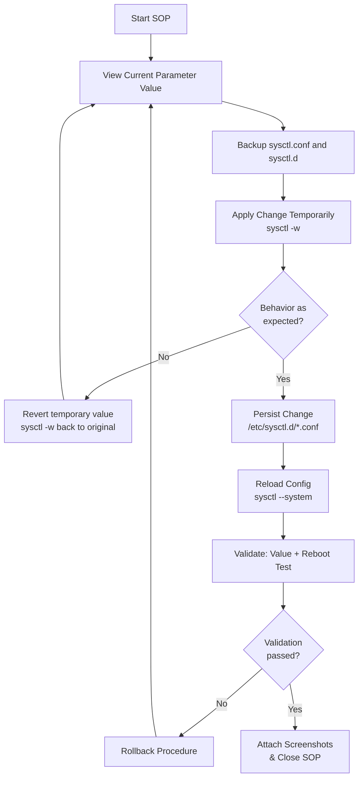
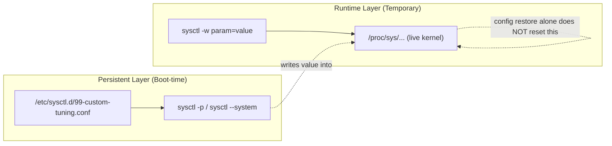
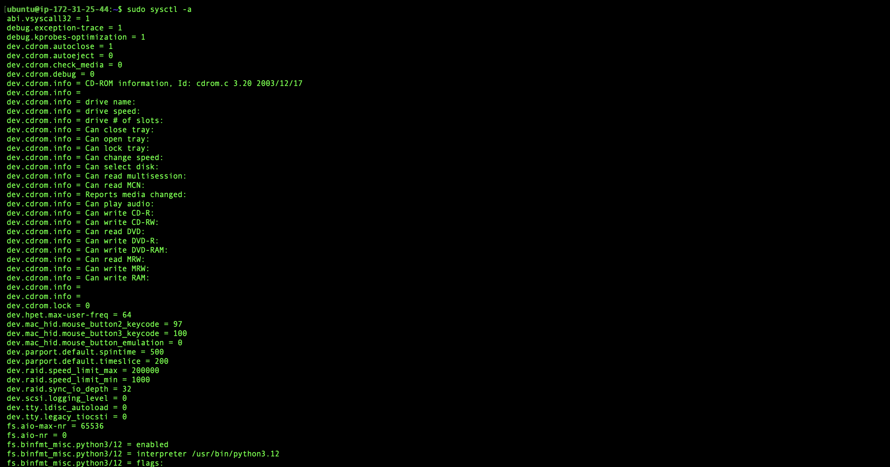
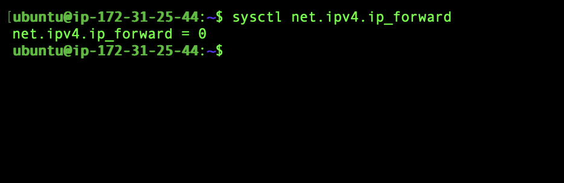
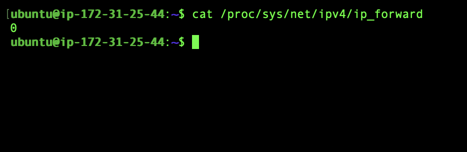
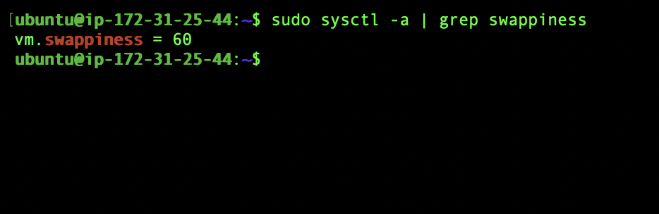
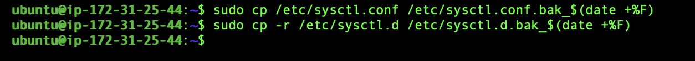
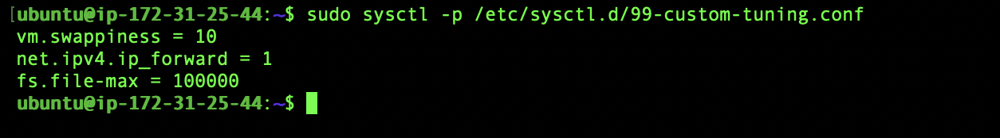
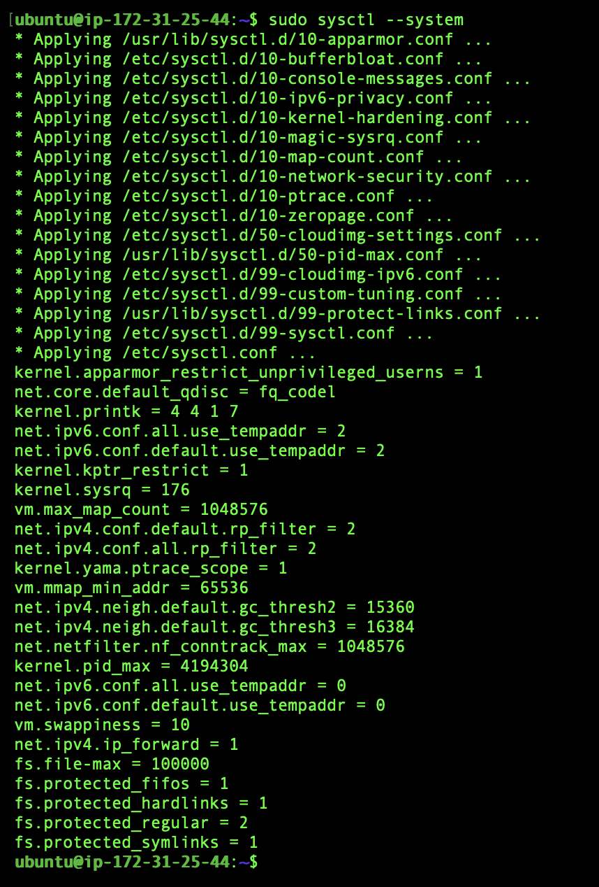
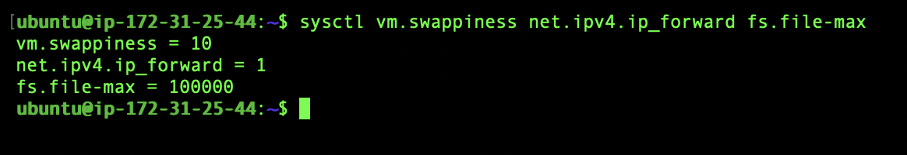

# SOP: Linux | Kernel Parameter Management Using sysctl

---

# Author Table

| **Author** | **Created On** | **Version** | **Last Updated By** | **Last Edited On** | **L0 Reviewer** | **L1 Reviewer** | **L2 Reviewer** |
| ---------- | -------------- | ----------- | ------------------- | ------------------ | --------------- | --------------- | --------------- |
| Sahil      | 24-08-26       | 1.0         | Sahil               | 27-08-26           | `Diviya M`      | `Ayush Verma`   | `Mahesh Kumar / Varun` |

---

# Table of Contents

1. [Introduction](#1-introduction)
2. [Purpose](#2-purpose)
3. [Prerequisites](#3-prerequisites)
   - [3.1 Access & Permissions](#31-access--permissions)
   - [3.2 System Requirements](#32-system-requirements)
   - [3.3 Tools Used](#33-tools-used)
4. [Roles & Responsibilities](#4-roles--responsibilities)
5. [Procedure Overview](#5-procedure-overview)
6. [View Kernel Parameters](#6-view-kernel-parameters)
7. [Apply Kernel Parameters (Temporary)](#7-apply-kernel-parameters-temporary)
8. [Persist Kernel Parameters (Permanent)](#8-persist-kernel-parameters-permanent)
9. [Rollback Procedure](#9-rollback-procedure)
10. [Validation](#10-validation)
11. [Use Cases](#11-use-cases)
12. [Troubleshooting](#12-troubleshooting)
13. [Best Practices](#13-best-practices)
14. [Conclusion](#14-conclusion)
15. [Contact Information](#15-contact-information)
16. [References](#16-references)

---

# 1. Introduction

This SOP provides a structured guide to viewing, applying, and persisting **kernel parameter changes** using `sysctl` on **Linux (Ubuntu 22.04/24.04 LTS)** servers, for the purpose of performance or security tuning.

It covers the required checks, configuration steps, verification, validation, rollback, and troubleshooting needed to keep kernel-level tuning consistent, auditable, and reversible across environments.

---

# 2. Purpose

The purpose of this SOP is to provide a standardized procedure for:

- Viewing current kernel parameter values under `/proc/sys/` using `sysctl`
- Applying a parameter change temporarily (runtime only, safe to test)
- Persisting an approved change permanently via `/etc/sysctl.d/`
- Rolling back a change safely when the restored config does not, by itself, reset the live kernel value
- Validating that a configured parameter is active and survives a reboot

These procedures help maintain **system stability, security posture, performance, and operational consistency**.

---

# 3. Prerequisites

### 3.1 Access & Permissions

| **Prerequisite**   | **Details**                                                                                      |
| ------------------ | ------------------------------------------------------------------------------------------------ |
| SSH Access         | SSH access to the target server                                                                  |
| Privileges         | `sudo` / root privileges to view and modify kernel parameters                                    |
| Edit Access        | Access to edit files under `/etc/sysctl.d/` and `/etc/sysctl.conf`                               |
| Out-of-band Access | Console/out-of-band access available in case a networking parameter change causes an SSH lockout |

### 3.2 System Requirements

| **Requirement**   | **Details**                                                                             |
| ----------------- | --------------------------------------------------------------------------------------- |
| OS & Access       | Ubuntu Server 22.04 LTS or 24.04 LTS with SSH/terminal access                           |
| Required Packages | `procps` (provides `sysctl`, pre-installed on most distros)                             |
| Permissions       | `sudo`/root access where required                                                       |
| Backup Space      | Sufficient space to back up existing `sysctl.conf` and `sysctl.d` before making changes |

### 3.3 Tools Used

| **Command/File**                | **Purpose**                                                                                        |
| ------------------------------- | -------------------------------------------------------------------------------------------------- |
| `sysctl`                        | Views and modifies kernel parameters at runtime                                                    |
| `/proc/sys/`                    | Virtual filesystem exposing live kernel parameters                                                 |
| `/etc/sysctl.conf`              | Main persistent sysctl configuration file                                                          |
| `/etc/sysctl.d/*.conf`          | Modular, isolated persistent configuration files (recommended over editing `sysctl.conf` directly) |
| `sysctl -p` / `sysctl --system` | Applies/reloads persisted configuration without a reboot                                           |

---

# 4. Roles & Responsibilities

| **Role**                               | **Responsibility**                                                                                |
| -------------------------------------- | ------------------------------------------------------------------------------------------------- |
| System Administrator / DevOps Engineer | Executes the checks, applies and persists parameter changes, and attaches screenshots as evidence |
| Application Owner                      | Confirms the tuning values required for the application/workload                                  |
| Reviewer (L0/L1/L2)                    | Reviews the completed SOP checklist, risk assessment, and evidence before sign-off                |

---

# 5. Procedure Overview

The diagram below summarizes the end-to-end flow followed in this SOP — from viewing the current value through to validation and, if needed, rollback.



> [!NOTE]
> Each decision point above maps to a numbered section below: viewing (Section 6), applying (Section 7), persisting (Section 8), rollback (Section 9), and validation (Section 10).

The diagram below shows how a temporary (runtime) change relates to a persisted (boot-time) change, and why restoring a config file alone does not reset the live value.



> [!NOTE]
> Restoring or deleting a config file only changes what gets loaded on the **next** read. It does **not** automatically push a new value into the already-running kernel (`A2` above). Rollback must explicitly re-push the original value with `sysctl -w` — see Section 9.

---

# 6. View Kernel Parameters

**Quick reference**

| **Step** | **Command**                        | **Purpose**                                              |
| -------- | ---------------------------------- | -------------------------------------------------------- |
| 6.1      | `sudo sysctl -a`                   | List every active kernel parameter and its current value |
| 6.2      | `sysctl <parameter>`               | View the value of one specific parameter                 |
| 6.3      | `cat /proc/sys/<path>`             | Read a parameter directly from the proc filesystem       |
| 6.4      | `sudo sysctl -a \| grep <keyword>` | Search for a parameter by keyword                        |

## Step 6.1: List all current kernel parameters

```bash
sudo sysctl -a
```

<details>
<summary>📸 <strong>Screenshot - sysctl -a output</strong></summary>



</details>

---

## Step 6.2: View a specific parameter

```bash
sysctl net.ipv4.ip_forward
```

Expected output:

```text
net.ipv4.ip_forward = 0
```

<details>
<summary>📸 <strong>Screenshot - specific parameter value</strong></summary>



</details>

---

## Step 6.3: Read a parameter directly from proc

```bash
cat /proc/sys/net/ipv4/ip_forward
```

<details>
<summary>📸 <strong>Screenshot - /proc/sys read</strong></summary>



</details>

---

## Step 6.4: Search parameters by keyword

```bash
sudo sysctl -a | grep swappiness
```

Useful when the exact parameter name is not known in advance.

<details>
<summary>📸 <strong>Screenshot - keyword search output</strong></summary>



</details>

---

# 7. Apply Kernel Parameters (Temporary)

Temporary changes take effect immediately at runtime but do **not** survive a reboot. Always validate here before persisting.

**Quick reference**

| **Step** | **Command**                              | **Purpose**                              |
| -------- | ---------------------------------------- | ---------------------------------------- |
| 7.1      | `sudo cp ...bak_$(date +%F)`             | Backup existing config before any change |
| 7.2      | `sudo sysctl -w <param>=<value>`         | Apply a parameter change at runtime      |
| 7.3      | `echo <value> \| sudo tee /proc/sys/...` | Alternative: direct proc write           |
| 7.4      | `sysctl <param>`                         | Verify the applied value                 |

## Step 7.1: Backup existing configuration

```bash
sudo cp /etc/sysctl.conf /etc/sysctl.conf.bak_$(date +%F)
sudo cp -r /etc/sysctl.d /etc/sysctl.d.bak_$(date +%F)
```

This backup is required for a clean rollback later (Section 9). Take it **before** making any change.

<details>
<summary>📸 <strong>Screenshot - backup files created</strong></summary>



</details>

---

## Step 7.2: Apply a parameter at runtime

```bash
sudo sysctl -w vm.swappiness=10
```

Expected output:

```text
vm.swappiness = 10
```

<details>
<summary>📸 <strong>Screenshot - sysctl -w applied</strong></summary>


</details>

---

## Step 7.3: Alternative — write directly to proc

```bash
echo 10 | sudo tee /proc/sys/vm/swappiness
```

---

## Step 7.4: Verify the change

```bash
sysctl vm.swappiness
```

**Note:** This change is runtime-only — if the value is wrong, a reboot alone reverts it. No persistence risk yet.

<details>
<summary>📸 <strong>Screenshot - verified runtime value</strong></summary>


</details>

---

# 8. Persist Kernel Parameters (Permanent)

Once the temporary change is validated, persist it so it survives a reboot.

**Quick reference**

| **Step** | **Command**                                     | **Purpose**                                  |
| -------- | ----------------------------------------------- | -------------------------------------------- |
| 8.1      | `sudo nano /etc/sysctl.d/99-custom-tuning.conf` | Create a dedicated, isolated config file     |
| 8.2      | `sudo sysctl -p <file>`                         | Apply the config file                        |
| 8.3      | `sudo sysctl --system`                          | Reload all sysctl config files in load order |

## Step 8.1: Create a dedicated config file

```bash
sudo nano /etc/sysctl.d/99-custom-tuning.conf
```

### Configuration

```text
vm.swappiness = 10
net.ipv4.ip_forward = 1
fs.file-max = 100000
```

Use a dedicated file under `/etc/sysctl.d/` instead of editing `/etc/sysctl.conf` directly — this isolates custom tuning from OS defaults and makes rollback a single file operation.

<details>
<summary>📸 <strong>Screenshot - config file contents</strong></summary>


</details>

---

## Step 8.2: Apply the config file

```bash
sudo sysctl -p /etc/sysctl.d/99-custom-tuning.conf
```

<details>
<summary>📸 <strong>Screenshot - sysctl -p applied</strong></summary>



</details>

---

## Step 8.3: Reload all sysctl config files

```bash
sudo sysctl --system
```

<details>
<summary>📸 <strong>Screenshot - sysctl --system output</strong></summary>



</details>

---

# 9. Rollback Procedure

If a persisted change causes unexpected behaviour, revert as follows. **Restoring or deleting config files alone does not reset the live kernel value** — the rollback has two parts.

| **Step** | **Action**                                               | **Command**                                                                |
| -------- | -------------------------------------------------------- | -------------------------------------------------------------------------- |
| 1        | Remove the change file                                   | `sudo rm -f /etc/sysctl.d/99-custom-tuning.conf`                           |
| 2        | Find the original value from backup                      | `grep -rE "vm.swappiness\|ip_forward\|file-max" /etc/sysctl.d.bak_<date>/` |
| 3        | Manually re-push the original value into the live kernel | `sudo sysctl -w vm.swappiness=<original_value>`                            |
| 4        | Reload config                                            | `sudo sysctl --system`                                                     |
| 5        | Reboot and confirm the value holds long-term             | `sudo reboot`                                                              |

> [!NOTE]
> If `grep` finds no value for a parameter in the backup, it was only ever a kernel default — use Ubuntu's standard default (`vm.swappiness=60`, `net.ipv4.ip_forward=0`), or for `fs.file-max`, let it recalculate on reboot rather than guessing a fixed number.

<details>
<summary>📸 <strong>Screenshot - rollback confirmation</strong></summary>



</details>

---

# 10. Validation

### Validate Applied/Persisted Value

```bash
sysctl vm.swappiness net.ipv4.ip_forward fs.file-max
```

**Expected:** Each value matches the intended setting.

### Validate Persistence Across Reboot

```bash
sudo reboot
sysctl vm.swappiness net.ipv4.ip_forward fs.file-max
```

**Expected:** Values match the pre-reboot configured state, not the old default.

### Final Validation Checklist

| **Validation**                               | **Expected Result**                                   |
| -------------------------------------------- | ----------------------------------------------------- |
| `sysctl <parameter>` immediately after apply | Matches the intended value                            |
| `sysctl <parameter>` after `sysctl --system` | Matches the persisted config file                     |
| `sysctl <parameter>` after reboot            | Still matches — confirms true persistence             |
| Dependent services (networking, DB, app)     | Healthy post-reboot                                   |
| Screenshots                                  | Attached at their respective placeholders as evidence |

---

# 11. Use Cases

| **Scenario**                                          | **Commands / Actions**                                                                                      |
| ----------------------------------------------------- | ----------------------------------------------------------------------------------------------------------- |
| Application under memory pressure, excessive swapping | Lower `vm.swappiness` (Step 7.2), validate app behavior, then persist (Step 8)                              |
| Server needs to act as a router/gateway               | Set `net.ipv4.ip_forward = 1` temporarily (Step 7.2), validate routing, then persist                        |
| Application hitting "too many open files" system-wide | Raise `fs.file-max` (Step 7.2/8.1) after confirming the process-level `ulimit` is not the actual bottleneck |
| Security hardening review flags SYN flood exposure    | Set `net.ipv4.tcp_syncookies = 1` and persist under `/etc/sysctl.d/`                                        |
| A prior tuning change needs to be safely undone       | Follow the two-part Rollback Procedure (Section 9) — file removal **and** manual live re-push               |

---

# 12. Troubleshooting

| **Issue**                                          | **Cause**                                                                              | **Solution**                                                                                                      |
| -------------------------------------------------- | -------------------------------------------------------------------------------------- | ----------------------------------------------------------------------------------------------------------------- |
| `sysctl -p` returns "No such file or directory"    | Typo in parameter name, or parameter removed in a newer kernel                         | Confirm the exact name with `sudo sysctl -a \| grep <keyword>`                                                    |
| Value reverts after reboot                         | Change was only applied with `sysctl -w`, never persisted                              | Repeat the Persist steps (Section 8) and confirm with `sysctl --system`                                           |
| Value doesn't change after restoring backup config | Restoring/removing a config file does not reset the already-running kernel value       | Manually re-push with `sudo sysctl -w <param>=<value>` (Section 9)                                                |
| Permission denied                                  | Command run without `sudo`                                                             | Re-run with `sudo`                                                                                                |
| Network drops after a `net.*` parameter change     | Incorrect value for this host/environment (e.g. forwarding disabled on a routing host) | Use console/out-of-band access to roll back immediately                                                           |
| Same parameter set in multiple `.conf` files       | Duplicate entries across `sysctl.conf` and `sysctl.d/*.conf`                           | The last-loaded file wins — search with `grep -r "<param>" /etc/sysctl.conf /etc/sysctl.d/` and remove duplicates |

---

# 13. Best Practices

| **Best Practice**                            | **Description**                                                                                              |
| -------------------------------------------- | ------------------------------------------------------------------------------------------------------------ |
| Always test with `sysctl -w` first           | Validate the value at runtime before persisting — no reboot risk if it's wrong                               |
| Use `/etc/sysctl.d/` over `sysctl.conf`      | Isolates custom tuning from OS defaults, making review and rollback a single file operation                  |
| Backup before every change                   | `sysctl.conf` and `sysctl.d` should be backed up before any modification, not just once                      |
| Treat rollback as two steps                  | Config file removal **and** a manual `sysctl -w` re-push — file removal alone is not a complete rollback     |
| Avoid disabling security parameters casually | `tcp_syncookies`, `randomize_va_space`, etc. should only be changed with clear justification and peer review |
| Validate after every reboot                  | Some persistence issues only surface after a real reboot, not just `sysctl --system`                         |

---

# 14. Conclusion

This SOP provides a standardized approach to viewing, applying, and persisting kernel parameters using `sysctl` on Ubuntu servers.

Following these procedures helps administrators maintain **performance, security posture, and operational stability**, while providing a consistent, evidence-backed approach to configuration, validation, rollback, and troubleshooting. In particular, treating rollback as a two-part process — config removal plus a manual live re-push — closes a gap that a file-only rollback would otherwise miss.

---

# 15. Contact Information

| **Name** | **Email** |
| -------- | --------- |
| Sahil    | `sahil.butola.snaatak@mygurukulam.co` |

---

# 16. References

| **Topic**                                                                                                    | **Description**                                  |
| ------------------------------------------------------------------------------------------------------------ | ------------------------------------------------ |
| [sysctl man page](https://man7.org/linux/man-pages/man8/sysctl.8.html)                                       | `sysctl` command reference                       |
| [sysctl.d man page](https://man7.org/linux/man-pages/man5/sysctl.d.5.html)                                   | `sysctl.d` configuration reference               |
| [Ubuntu Server documentation](https://ubuntu.com/server/docs)                                                | Official Ubuntu Server documentation             |
| [Application Template](https://github.com/OT-MICROSERVICES/documentation-template/wiki/Application-Template) | Documentation format/index followed for this SOP |
| [Software Template](https://github.com/OT-MICROSERVICES/documentation-template/wiki/Software-Template)       | Documentation format/index followed for this SOP |
