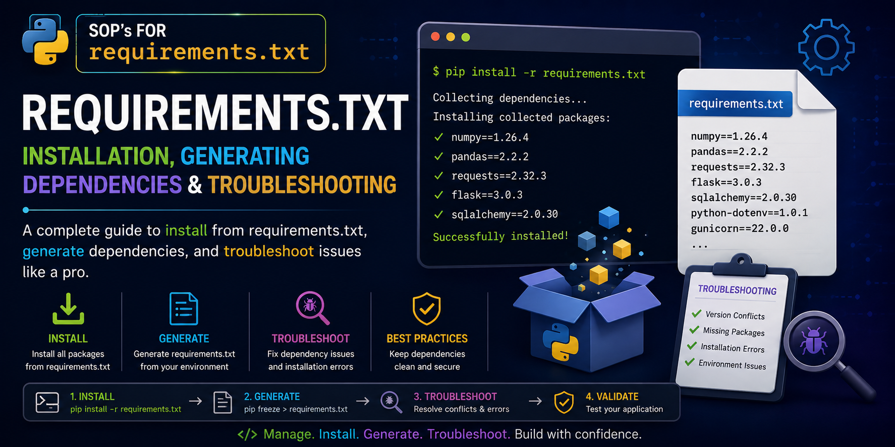
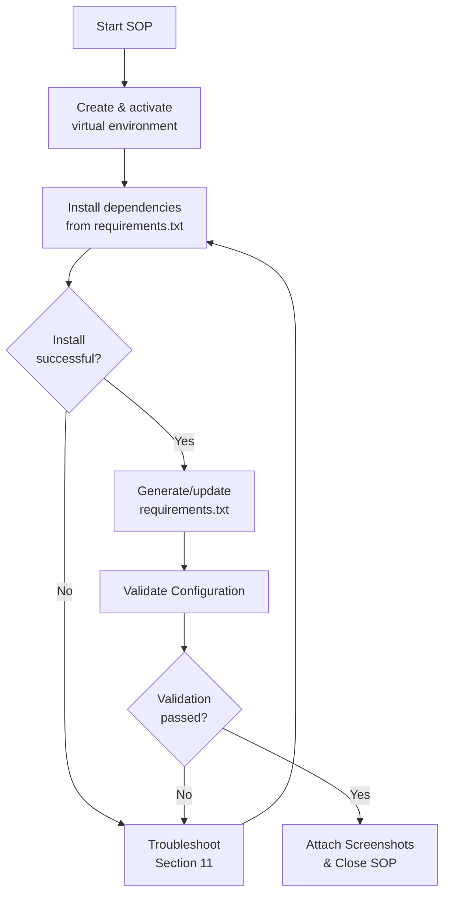

# SOP: Python | Ubuntu 24.04 | Dependency Management Using requirements.txt

---

# Author Table

| **Author** | **Created On** | **Version** | **Last Updated By** | **Last Edited On** | **L0 Reviewer** | **L1 Reviewer** | **L2 Reviewer** |
|---|---|---|---|---|---|---|---|
| Sahil | 27-08-26 | 1.0 | Sahil | 27-08-26 | `<Reviewer Name>` | `<Reviewer Name>` | `<Reviewer Name>` |

---

# Table of Contents

1. [Introduction](#1-introduction)
2. [Purpose](#2-purpose)
3. [Prerequisites](#3-prerequisites)
   - [3.1 Access & Permissions](#31-access--permissions)
   - [3.2 System Requirements](#32-system-requirements)
   - [3.3 Tools Used](#33-tools-used)
4. [Roles & Responsibilities](#4-roles--responsibilities)
5. [Procedure Overview](#5-procedure-overview)
6. [Install Dependencies from requirements.txt](#6-install-dependencies-from-requirementstxt)
7. [Generate requirements.txt](#7-generate-requirementstxt)
8. [Environment Isolation (PEP 668)](#8-environment-isolation-pep-668)
9. [Validation](#9-validation)
10. [Use Cases](#10-use-cases)
11. [Troubleshooting](#11-troubleshooting)
12. [Best Practices](#12-best-practices)
13. [Conclusion](#13-conclusion)
14. [Contact Information](#14-contact-information)
15. [References](#15-references)

---

# 1. Introduction

This SOP provides a structured guide to **installing dependencies from `requirements.txt`**, **generating a `requirements.txt` file**, and **troubleshooting dependency issues** in Python projects on **Ubuntu 24.04**.

It covers the required setup, installation steps, dependency file generation, verification, validation, and troubleshooting needed to keep Python environments consistent and reproducible.

---

# 2. Purpose

The purpose of this SOP is to provide a standardized procedure for:

- Installing all project dependencies listed in `requirements.txt`
- Generating a `requirements.txt` file from an existing environment or from project imports only
- Verifying installed packages match the declared dependency list
- Resolving common dependency installation failures, including Ubuntu 24's externally-managed-environment restriction

These procedures help maintain **environment consistency, reproducible builds, and operational reliability** across development, CI, and production systems.

---

# 3. Prerequisites

### 3.1 Access & Permissions

| **Prerequisite** | **Details** |
|---|---|
| Terminal Access | SSH/terminal access to the target machine |
| Privileges | `sudo` access to install system packages (`python3-venv`, `python3-pip`) |
| Project Access | Access to the project directory containing (or requiring) `requirements.txt` |

### 3.2 System Requirements

| **Requirement** | **Details** |
|---|---|
| OS & Access | Ubuntu 24.04+ with SSH/terminal access |
| Required Packages | `python3`, `python3-venv`, `python3-pip` |
| Permissions | `sudo` access where required |
| Network | Internet access to PyPI (or internal package mirror) |
| Configuration | An active Python virtual environment (required on Ubuntu 24) |

### 3.3 Tools Used

| **Command/File** | **Purpose** |
|---|---|
| `pip` | Installs, upgrades, and manages Python packages |
| `python3 -m venv` | Creates an isolated Python virtual environment |
| `requirements.txt` | Declares a project's Python dependencies and versions |
| `pip freeze` | Captures the full set of installed packages and versions |
| `pipreqs` | Generates a requirements file based only on imports used in the code |
| `pip check` | Verifies there are no dependency conflicts in the current environment |

---

# 4. Roles & Responsibilities

| **Role** | **Responsibility** |
|---|---|
| Developer / DevOps Engineer | Installs dependencies, generates/updates `requirements.txt`, and attaches screenshots as evidence |
| Project Maintainer | Confirms which packages and version constraints belong in `requirements.txt` |
| Reviewer (L0/L1/L2) | Reviews the completed SOP checklist and evidence before sign-off |

---

# 5. Procedure Overview

The diagram below summarizes the end-to-end flow followed in this SOP — from environment setup through installation, generation, and validation.



> [!NOTE]
> Each decision point above maps to a numbered section below: installation (Section 6), generation (Section 7), environment isolation (Section 8), and validation (Section 9).

---

# 6. Install Dependencies from requirements.txt

**Quick reference**

| **Step** | **Command** | **Purpose** |
|---|---|---|
| 6.1 | `python3 -m venv venv && source venv/bin/activate` | Create and activate an isolated environment |
| 6.2 | `pip install -r requirements.txt` | Install all listed dependencies |
| 6.3 | `pip install -r requirements.txt --no-cache-dir` | Force a fresh download, bypassing pip's cache |
| 6.4 | `pip install -r requirements.txt --upgrade` | Upgrade installed packages to match requirements.txt |

## Step 6.1: Create and activate a virtual environment

```bash
python3 -m venv venv
source venv/bin/activate
```

Expected output:

```text
(venv) user@host:~/project$
```

<details>
<summary>📸 <strong>Screenshot - Virtual environment activated</strong></summary>


</details>

---

## Step 6.2: Install all listed packages

```bash
pip install -r requirements.txt
```

<details>
<summary>📸 <strong>Screenshot - Dependencies installed successfully</strong></summary>


</details>

---

## Step 6.3: Install without cached packages

```bash
pip install -r requirements.txt --no-cache-dir
```

---

## Step 6.4: Upgrade existing packages to match requirements.txt

```bash
pip install -r requirements.txt --upgrade
```

<details>
<summary>📸 <strong>Screenshot - Packages upgraded</strong></summary>


</details>

---

# 7. Generate requirements.txt

**Quick reference**

| **Step** | **Command** | **Purpose** |
|---|---|---|
| 7.1 | `pip freeze > requirements.txt` | Snapshot every installed package and version |
| 7.2 | `pipreqs . --force` | Generate a file based only on packages actually imported |

## Step 7.1: Generate a full environment snapshot

```bash
pip freeze > requirements.txt
```

### Configuration

```text
Captures every installed package with its exact version,
regardless of whether it is imported by the project code.
```

### Verification

```bash
cat requirements.txt
```

Expected:

```text
flask==2.3.2
requests==2.31.0
numpy==1.26.4
```

<details>
<summary>📸 <strong>Screenshot - pip freeze output</strong></summary>


</details>

---

## Step 7.2: Generate based only on imported packages

```bash
pip install pipreqs
pipreqs . --force
```

<details>
<summary>📸 <strong>Screenshot - pipreqs output</strong></summary>


</details>

---

# 8. Environment Isolation (PEP 668)

## Step 8.1: Understand the externally-managed-environment error

```bash
pip install -r requirements.txt
```

Outside a virtual environment on Ubuntu 24.04, this fails with:

```text
error: externally-managed-environment
```

<details>
<summary>📸 <strong>Screenshot - externally-managed-environment error</strong></summary>


</details>

---

## Step 8.2: Resolve using a virtual environment (recommended)

```bash
python3 -m venv venv
source venv/bin/activate
pip install -r requirements.txt
```

> [!NOTE]
> Ubuntu 24.04 enforces PEP 668, blocking `pip install` into the system Python by default. Always activate a virtual environment before installing dependencies. Using `--break-system-packages` bypasses this protection and is not recommended outside throwaway or test systems.

---

# 9. Validation

### Validate Installed Packages

```bash
pip list
```

**Expected:** All packages listed in `requirements.txt` appear with matching versions.

### Validate Against requirements.txt

```bash
pip freeze | diff requirements.txt -
```

**Expected:** No output — installed environment matches `requirements.txt` exactly.

### Validate No Dependency Conflicts

```bash
pip check
```

**Expected:** `No broken requirements found.`

<details>
<summary>📸 <strong>Screenshot - validation output</strong></summary>


</details>

### Final Validation Checklist

| **Validation** | **Expected Result** |
|---|---|
| Virtual environment active | Shell prompt prefixed with `(venv)` |
| `pip install -r requirements.txt` completes | No errors, all packages installed |
| `pip check` | No broken dependency messages |
| `pip freeze` output matches `requirements.txt` | No diff output |
| Screenshots | Attached at their respective placeholders as evidence |

---

# 10. Use Cases

| **Scenario** | **Commands / Actions** |
|---|---|
| Setting up a new dev environment | `pip install -r requirements.txt` |
| Capturing current environment state | `pip freeze > requirements.txt` |
| Generating file from actual imports only | `pipreqs . --force` |
| Checking for dependency conflicts | `pip check` |
| Confirming environment matches requirements.txt | `pip freeze \| diff requirements.txt -` |

---

# 11. Troubleshooting

| **Issue** | **Cause** | **Solution** |
|---|---|---|
| `error: externally-managed-environment` | Ubuntu 24 blocks pip installs outside a venv (PEP 668) | Activate a virtual environment before installing |
| `Could not find a version that satisfies...` | Package/version does not exist or is unavailable | Verify package name/version on PyPI |
| Dependency version conflict | Two packages require incompatible versions of a shared dependency | Run `pip check`; adjust version pins in `requirements.txt` |
| Installed packages don't match requirements.txt | Wrong virtual environment active, or file not regenerated | Activate the correct venv; regenerate with `pip freeze` |
| `pip: command not found` | pip not installed or not on PATH | Install pip or use `python3 -m pip` instead |
| Slow or failed downloads | Network/proxy issues or corrupted cache | Retry with `--no-cache-dir`; check network/proxy settings |

---

# 12. Best Practices

| **Best Practice** | **Description** |
|---|---|
| Always use a virtual environment | Avoids Ubuntu 24's externally-managed-environment restriction and prevents dependency conflicts |
| Pin exact versions for production | Use `==` in `requirements.txt` to ensure reproducible builds |
| Regenerate requirements.txt deliberately | Use `pipreqs` for imports-only files rather than full `pip freeze` dumps where possible |
| Run `pip check` after installs | Catches broken or conflicting dependencies early |
| Keep requirements.txt in version control | Provides an auditable, shared source of truth for the team |

---

# 13. Conclusion

This SOP provides a standardized approach to installing, generating, and troubleshooting Python dependencies using `requirements.txt` on Ubuntu 24.04.

Following these procedures helps developers maintain **reliability, reproducibility, and operational stability**, while providing a consistent, evidence-backed approach to configuration, validation, and troubleshooting — including Ubuntu 24's PEP 668 environment restrictions.

---

# 14. Contact Information

| **Name** | **Email** |
|---|---|
| Sahil | [<email>](mailto:<email>) |

---

# 15. References

| **Topic** | **Description** |
|---|---|
| [pip Documentation](https://pip.pypa.io/en/stable/) | Official pip documentation |
| [requirements.txt Format](https://pip.pypa.io/en/stable/reference/requirements-file-format/) | requirements.txt file format reference |
| [pipreqs](https://pypi.org/project/pipreqs/) | pipreqs documentation |
| [PEP 668](https://peps.python.org/pep-0668/) | Externally managed Python environments |
